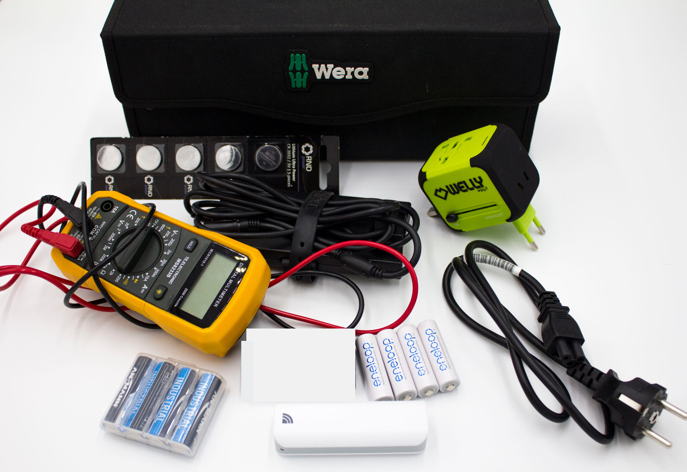

# #ASKmod Travel-Set

#ASKmod is a part of the #ASKotec project: [Official Website](https://askotec.openculture.agency)

The Travel Set includes all electronic devices that can be taken on a flight only in the hand luggage.

### [View product in #ASKotec Stockroom](https://askotec.openculture.agency/product/askmod-travel-set/)

## How to build

This #ASKmod is based on a empty [Travel box](https://askotec.openculture.agency/product/textile-tool-box/) and the content can be seen in the [CONTENT file](CONTENT.md).

## Developers

Feel free to develop this #ASKmod further, modify it or create your own #ASKmod.
If you have any questions or suggestions, feel free to [write us an issue](https://github.com/opencultureagency/ASKmod-Travel-Set/issues/new).

## Release Notes

- [v.1.0.0](https://github.com/opencultureagency/ASKmod-Travel-Set/tree/v.1.0.0): [content file](CONTENT.md)

## Contributers

- [r0g Agency](https://openculture.agency/)
- Timm Wille
- Martin Häuer
- [Steven Kovats](https://openculture.agency/)

## License

 This work is licensed under a <a rel="license" href="http://creativecommons.org/licenses/by-sa/4.0/">Creative Commons Attribution-ShareAlike 4.0 International License</a>.